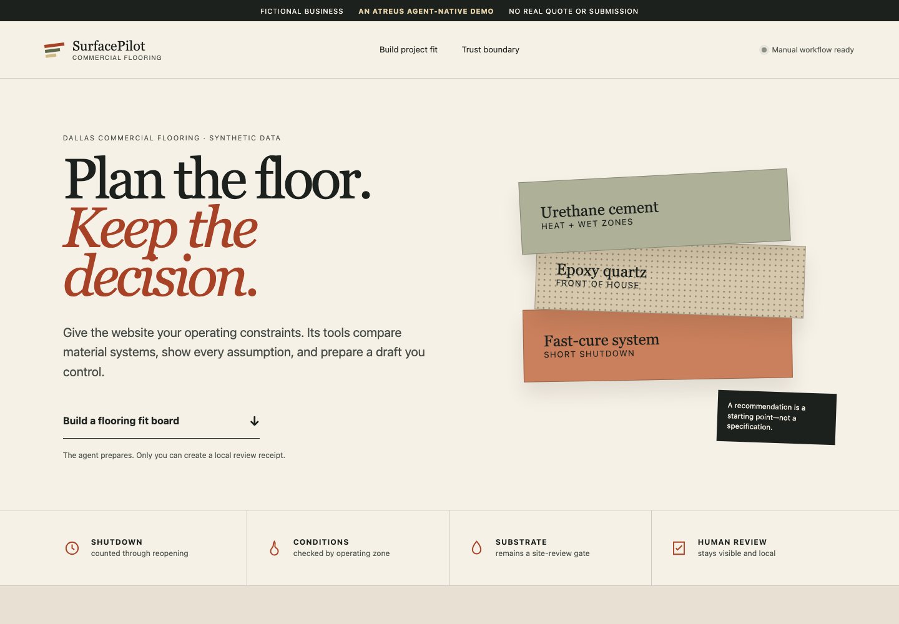
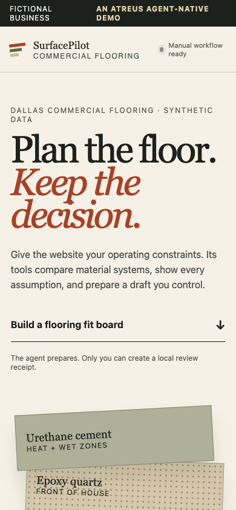

# SurfacePilot Commercial Flooring

SurfacePilot is a clearly fictional Dallas commercial-flooring website built to demonstrate an **ATREUS agent-native business surface**. The normal website and WebMCP tools share the same deterministic domain logic. An agent can research fit and stage a brief, while only the human-facing interface can create a local review receipt.

> Demo only. All business facts are synthetic. Nothing is quoted, booked, submitted, published, or sent.

## Live demo

[Open SurfacePilot Commercial Flooring](https://atreus-agent-native-surface-julianc1ks-projects.vercel.app)

Material Ledger is the crowned interface:

<p>
  
  
</p>

To reset the demo, select **Reset demonstration** in the footer. This clears the fit board, staged draft, and local receipt, then restores the canonical Dallas restaurant inputs. Nothing is deleted from a server because the demo has no backend.

## What it proves

- Four narrow WebMCP tools expose approved facts, service-area checks, a flooring fit board, and a review draft.
- The visible page updates when tools run; unsupported browsers retain the complete manual workflow.
- No tool can approve, submit, message, charge, book, or publish.
- A local approval receipt is bound to the current draft revision and SHA-256 content hash. Editing or rebuilding invalidates it.
- There is no backend, database, analytics, AI API, PII collection, or external data send.

## Run locally

Requires Node.js 24 or newer.

```bash
npm ci
npm run dev
```

Open Material Ledger at `http://localhost:5173/`.

Use the manual controls to reproduce the canonical prompt:

> I need durable flooring for a 1,500-square-foot Dallas restaurant with a short shutdown.

## Documentation

- [WebMCP Challenge submission draft](./docs/challenge-submission.md)
- [Under-three-minute demo script](./docs/demo-script.md) — recording and public upload pending

## Verification

```bash
npm run check
npm run test:e2e
```

`npm run check` runs linting, TypeScript, unit tests, and the production build. Playwright covers the complete human-only review boundary.

## WebMCP support

The adapter progressively registers tools through `document.modelContext` in clients that currently expose the WebMCP draft API. It uses the official [`webmcp-types`](https://www.npmjs.com/package/webmcp-types) package. Support remains experimental and may change; every browser still receives the complete manual workflow when WebMCP is unavailable.

WebMCP is experimental. See the [public specification repository](https://github.com/webmachinelearning/webmcp) and [current implementation status](https://github.com/webmachinelearning/webmcp/blob/main/implementation-status.md).

The narrated demo recording and public upload are pending. The recordable outline is in [`docs/demo-script.md`](./docs/demo-script.md).

## Trust boundary

The browser tools can prepare work but cannot perform consequential actions. `Approve local demo receipt` exists only as a visible human control, writes only to browser `localStorage`, and explicitly says that nothing was sent. See [SECURITY.md](./SECURITY.md) for the threat model.

## License

MIT. No private ATREUS Core code, OctoPoxy data, client assets, or credentials are included.
